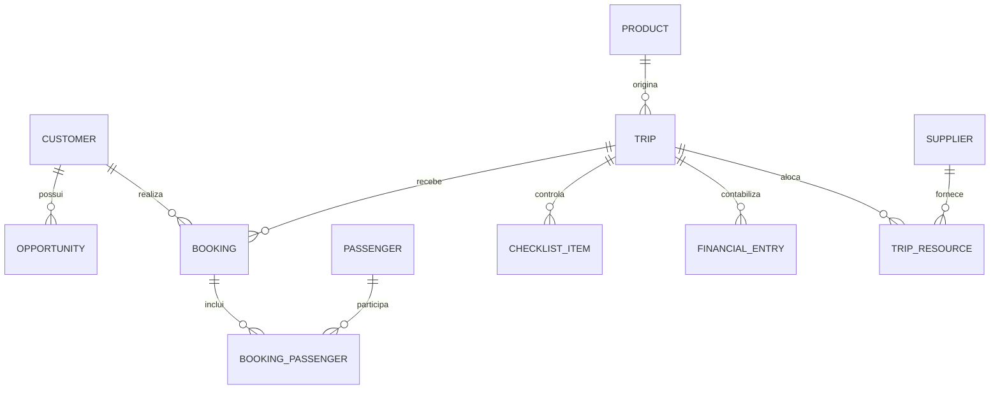

# Modelo de Dados do Toptur Operations

## 1. Convenções

- Chaves primárias: UUID.
- Tabelas principais: `created_at`, `updated_at`, `created_by` e, quando aplicável, `archived_at`.
- Códigos humanos: prefixo e sequência, por exemplo `TRIP-2026-001`.
- Dinheiro: `amount_cents` + `currency`.
- Datas de negócio usam data local; eventos usam timestamp UTC.
- Exclusão lógica para cadastros referenciados; registros financeiros e auditoria são imutáveis.

## 2. Entidades

### Identidade e governança

| Entidade | Campos essenciais | Relacionamentos |
| --- | --- | --- |
| User | name, email, status | N:N Role; 1:N Task, Decision |
| Role | name, permissions | N:N User |
| Task | title, status, due_at, priority | N:1 User; opcionalmente ligada a Trip/Opportunity/Supplier |
| Decision | title, context, decision, decided_at | N:1 User; N:N Task |
| AuditEvent | actor, action, entity_type, entity_id, before, after | N:1 User |

### CRM e clientes

| Entidade | Campos essenciais | Relacionamentos |
| --- | --- | --- |
| Customer | type, name, document, contacts, consent status | 1:N Passenger, Opportunity, Booking, Survey |
| Passenger | full_name, birth_date, document data, accessibility notes | N:1 Customer; N:N Trip via BookingPassenger |
| Lead | source, received_at, product_type, status | 0..1 Customer; 0..1 Opportunity |
| Pipeline | product_type, name | 1:N PipelineStage |
| PipelineStage | name, order, probability, terminal_type | N:1 Pipeline; 1:N Opportunity |
| Opportunity | value, status, next_action_at, loss_reason | N:1 Customer, PipelineStage, User; 0..1 Booking |
| Activity | type, occurred_at, notes, next_action_at | N:1 Opportunity; N:1 User |

### Produtos, viagens e reservas

| Entidade | Campos essenciais | Relacionamentos |
| --- | --- | --- |
| Product | type, name, description, active | 1:N Trip |
| Trip | code, name, start_at, end_at, status, capacity | N:1 Product; 1:N Booking, ChecklistItem, TripResource, FinancialEntry |
| Booking | code, status, seats, gross_amount | N:1 Trip, Customer; N:N Passenger |
| BookingPassenger | boarding data, seat, status | N:1 Booking, Passenger |
| ChecklistTemplate | product_type, version | 1:N ChecklistTemplateItem |
| ChecklistItem | title, required, due_at, status, completed_at | N:1 Trip; N:1 User; opcionalmente originado de template |
| Incident | category, severity, description, resolution | N:1 Trip; N:1 User |

### Fornecedores e recursos

| Entidade | Campos essenciais | Relacionamentos |
| --- | --- | --- |
| Supplier | category, legal_name, document, status | 1:N SupplierDocument, SupplierEvaluation, Contract, TripResource |
| SupplierDocument | type, expires_at, file_key, status | N:1 Supplier |
| SupplierEvaluation | price, punctuality, quality, compliance, notes | N:1 Supplier; opcional N:1 Trip |
| Resource | type, identifier, capacity, status | N:1 Supplier; 1:N TripResource |
| TripResource | start_at, end_at, status | N:1 Trip, Resource; regra de não sobreposição |

### Financeiro

| Entidade | Campos essenciais | Relacionamentos |
| --- | --- | --- |
| FinancialCategory | type, name, variable_cost flag | 1:N FinancialEntry |
| FinancialEntry | scenario, type, amount_cents, due_at, paid_at, status | N:1 Trip, FinancialCategory, Supplier/Customer opcional |
| FinancialAdjustment | amount_cents, reason | N:1 FinancialEntry; N:1 User |
| TripFinancialSnapshot | revenue, variable_cost, fixed_allocated_cost, margin, break_even | N:1 Trip |

### Cliente, indicadores e integrações

| Entidade | Campos essenciais | Relacionamentos |
| --- | --- | --- |
| Survey | type, sent_at, answered_at, score, comment | N:1 Customer; opcional N:1 Trip |
| KpiDefinition | code, name, formula, frequency, owner_role | 1:N KpiSnapshot |
| KpiSnapshot | period_start, period_end, value, target, source | N:1 KpiDefinition; opcional N:1 Trip |
| IntegrationConnection | provider, status, configuration reference | 1:N SyncEvent |
| ExternalReference | provider, external_id, entity_type, entity_id | N:1 IntegrationConnection |
| SyncEvent | direction, status, idempotency_key, error | N:1 IntegrationConnection |

## 3. Relacionamentos críticos

## 4. Estados principais

- `Trip`: DRAFT → PLANNING → ON_SALE → CONFIRMED → READY → IN_PROGRESS → COMPLETED → CLOSED; também CANCELLED.
- `Opportunity`: OPEN → WON ou LOST.
- `Booking`: RESERVED → CONFIRMED → TRAVELLED; também CANCELLED ou NO_SHOW.
- `ChecklistItem`: PENDING → IN_PROGRESS → DONE; também BLOCKED ou WAIVED com justificativa.
- `Supplier`: PROSPECT → UNDER_REVIEW → APPROVED → SUSPENDED ou REJECTED.

## 5. Integridade

- Uma viagem fechada não aceita alteração direta em lançamentos financeiros.
- Um recurso não pode ter alocações confirmadas sobrepostas.
- Passageiro não pode ser duplicado na mesma reserva.
- Oportunidade ativa exige responsável e próxima ação.
- Viagem READY exige todos os itens obrigatórios concluídos ou dispensados com justificativa e alçada.
- Chaves externas são únicas por provedor e tipo de entidade.

